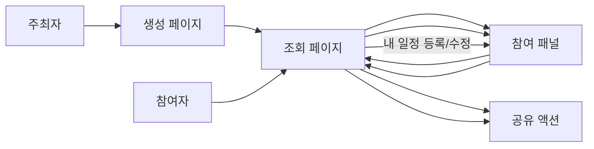
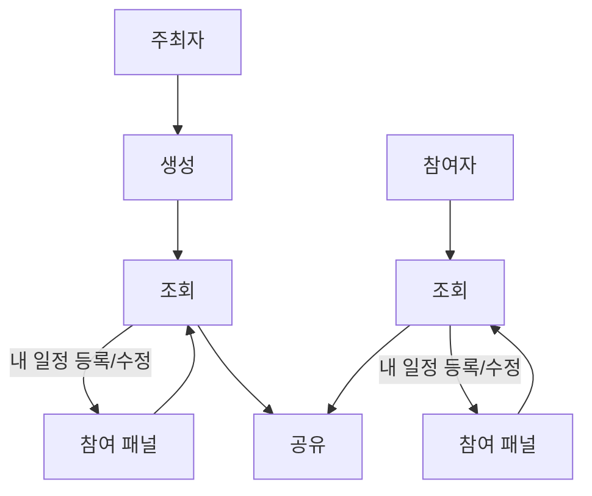

# 페이지 시나리오

## 문서 기준

- 이 문서는 `현재 배포 대상 구현 흐름`을 기준으로 작성한다.
- 향후 목표 시나리오가 아니라, 지금 코드에서 실제로 가능한 페이지 이동과 패널 전개만 다룬다.

사용자는 `주최자`와 `참여자`로 나뉘며, 화면은 `생성`, `조회`, `참여 패널`로 구성된다.
주최자는 `조회` 이후 후속 `공유` 액션으로 이어질 수 있다.
`조회` 화면에서는 `내 일정 등록/수정` 버튼으로 같은 화면 안의 `참여 패널`을 열 수 있다.
이벤트 화면 URL은 `/?{이벤트_ID}` 하나를 사용하며, 현재 구현은 이 URL에서 이벤트 상세 화면을 보여준다.
참여 입력은 별도 페이지 전환이 아니라 상세 화면 안 패널로 제공된다.
`공유` 기능은 현재 상세 화면의 액션 버튼으로 제공된다.

## 참조 문서

- 페이지 요구사항: [server-design.md](./server-design.md)
- 요구사항 기준 섹션: `2. 제품 요구사항`

## 페이지 링크

| 페이지 | 링크 |
| --- | --- |
| 생성 | `/` |
| 참여 패널 | `/?{이벤트_ID}` 내부 패널 |
| 조회 | `/?{이벤트_ID}` |

## 페이지 전이 규칙

- `생성` 페이지에서 생성이 완료되면 `조회` 화면 URL `/?{이벤트_ID}`로 이동한다.
- `조회` 화면에서는 `내 일정 등록/수정` 버튼을 통해 같은 화면 안의 `참여 패널`을 연다.
- `조회` 화면과 `참여 패널`은 같은 URL `/?{이벤트_ID}`를 공유한다.
- 현재 구현에는 로컬 저장소 기반 `참여/조회` 자동 분기 규칙이 없다.
- 주최자와 참여자 모두 `조회` 화면에서 `공유` 기능을 사용할 수 있다.

## 구현 기준 규칙

- `/?{eventId}` 직접 진입 시에는 `GET /api/events/{eventId}`로 이벤트를 조회한다.
- 조회 성공 시 이벤트 제목, 기간, 참여자 목록, 요약 카드, 액션 버튼을 상세 화면에 렌더링한다.
- 상세 화면의 공유 버튼은 현재 canonical URL `/?{eventId}`를 복사한다.
- `내 일정 등록/수정` 버튼은 같은 화면 안에서 참여 패널을 열고 닫는다.
- 현재 구현에는 로컬 저장소 기반 참여자 식별 복원, 자동 조회 모드 전환, 이름 비활성화 규칙이 없다.
- 이벤트 조회 결과가 `404`이면 전용 빈 상태 화면을 렌더링한다.

## 사용자별 이동 흐름

## 페이지 관점 시나리오

