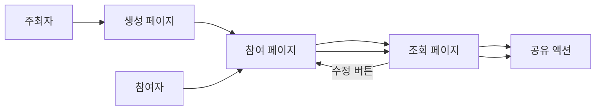
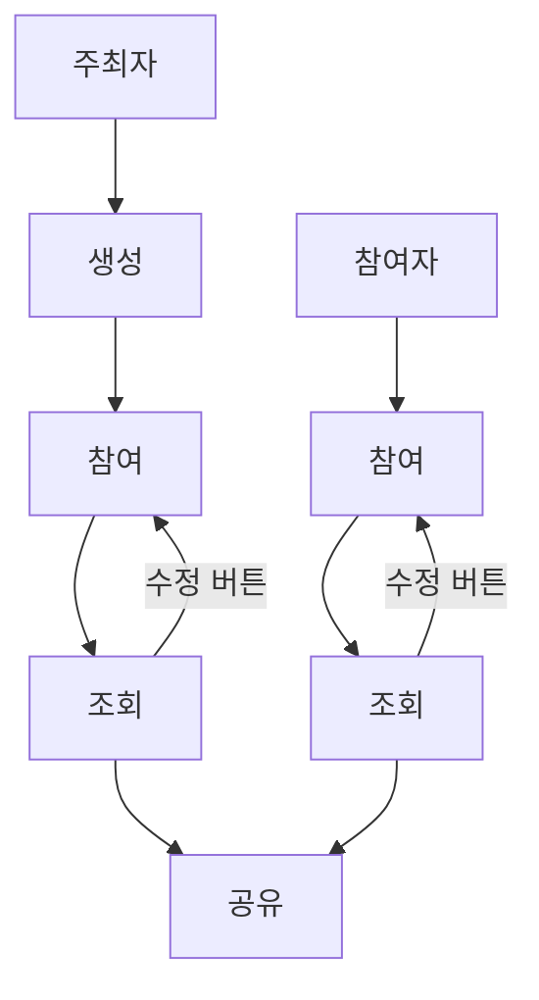

# 페이지 시나리오

사용자는 `주최자`와 `참여자`로 나뉘며, 페이지는 `생성`, `참여`, `조회`로 구성된다.
주최자는 `조회` 이후 반드시 후속 `공유` 액션으로 이어진다.
`조회` 페이지에서는 `수정` 버튼을 통해 다시 `참여` 페이지로 이동할 수 있다.
`참여` 페이지와 `조회` 페이지는 같은 URL `/?{이벤트_ID}`를 사용하며, 어떤 화면을 보여줄지는 로컬 세션 상태로 구분한다.
참여자 식별에 필요한 로컬 정보는 로컬 저장소에 유지한다.
`공유` 기능은 참여자도 사용할 수 있다.
새로고침 시 로컬 저장소에 참여자 식별 정보가 있으면 `조회` 페이지로 진입한다.

## 참조 문서

- 페이지 요구사항: [server-design.md](./server-design.md)
- 요구사항 기준 섹션: `2. 제품 요구사항`

## 페이지 링크

| 페이지 | 링크 |
| --- | --- |
| 생성 | `/` |
| 참여 | `/?{이벤트_ID}` |
| 조회 | `/?{이벤트_ID}` |

## 페이지 전이 규칙

- `생성` 페이지에서 생성이 완료되면 `참여` 페이지로 이동한다.
- `참여` 페이지에서 입력이 완료되면 `조회` 페이지로 이동한다.
- `조회` 페이지에서는 `수정` 버튼을 통해 `참여` 페이지로 다시 이동할 수 있다.
- `참여` 페이지와 `조회` 페이지는 같은 URL `/?{이벤트_ID}`를 사용하고, 로컬 세션 상태에 따라 화면 모드를 구분한다.
- `조회 -> 수정 -> 참여` 흐름에 필요한 참여자 식별 정보는 로컬 저장소를 사용해 유지한다.
- 새로고침 시 로컬 저장소에 참여자 식별 정보가 있으면 `조회` 페이지 모드로 진입한다.
- 주최자는 `조회` 이후 반드시 `공유` 액션을 수행한다.
- 참여자도 `조회` 페이지에서 `공유` 기능을 사용할 수 있다.

## 구현 기준 규칙

- 로컬 저장소 키는 `ejmn.participant.{eventId}` 형식을 사용한다.
- 로컬 저장소 값은 JSON 객체 `{ "name": string }` 형식을 사용한다.
- `/?{eventId}` 직접 진입 시에는 먼저 `GET /api/events/{eventId}`로 이벤트를 조회한 뒤 화면 모드를 결정한다.
- 조회 결과의 `members` 안에 로컬 저장소의 `name`과 같은 참여자가 있으면 `조회` 페이지로 진입한다.
- 로컬 저장소가 없거나, 저장된 `name`이 현재 이벤트의 `members`에 없으면 `참여` 페이지로 진입한다.
- 로컬 저장소는 `eventId` 단위로 분리해 저장하며, 다른 이벤트의 참여자 정보는 현재 이벤트 모드 결정에 사용하지 않는다.
- `참여` 페이지에서 `PATCH` 성공 시 로컬 저장소에 현재 `name`을 저장한 뒤 `조회` 페이지로 전환한다.
- `조회` 페이지에서 `수정` 버튼을 누르면 로컬 세션 상태만 `join`으로 바꾸고 URL은 유지한다.
- `수정` 버튼으로 진입한 `참여` 페이지에서는 로컬 저장소의 `name`을 입력값으로 미리 채우고 이름 입력은 비활성화한다.
- 공유 링크로 처음 진입한 `참여` 페이지에서는 이름 입력이 비어 있고 사용자가 직접 입력할 수 있어야 한다.
- 사용자가 새 이름을 입력하려는 신규 진입 상태에서는 "같은 이름을 입력하면 기존 일정이 수정될 수 있음" 안내 문구를 함께 노출할 수 있다.
- 이벤트 조회 결과가 `404`이면 해당 `eventId`의 로컬 저장소 키도 함께 삭제한다.

## 사용자별 이동 흐름

## 페이지 관점 시나리오

